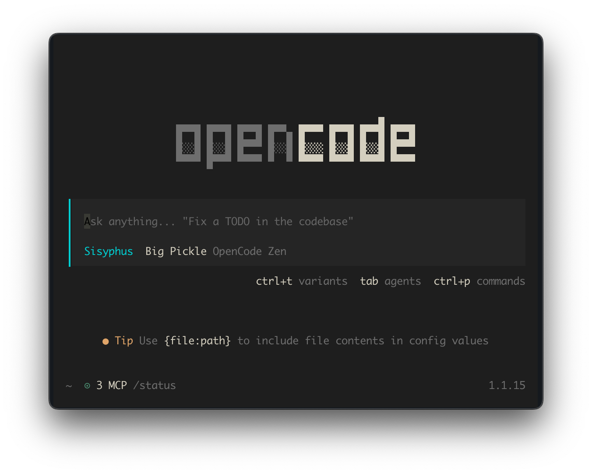
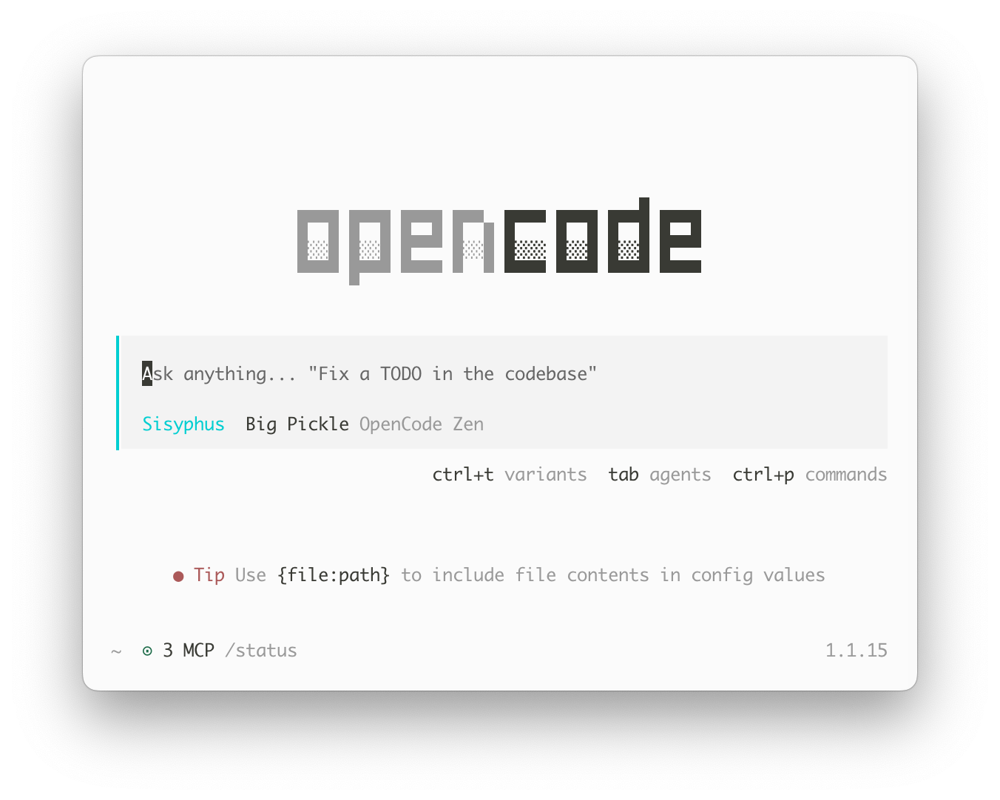
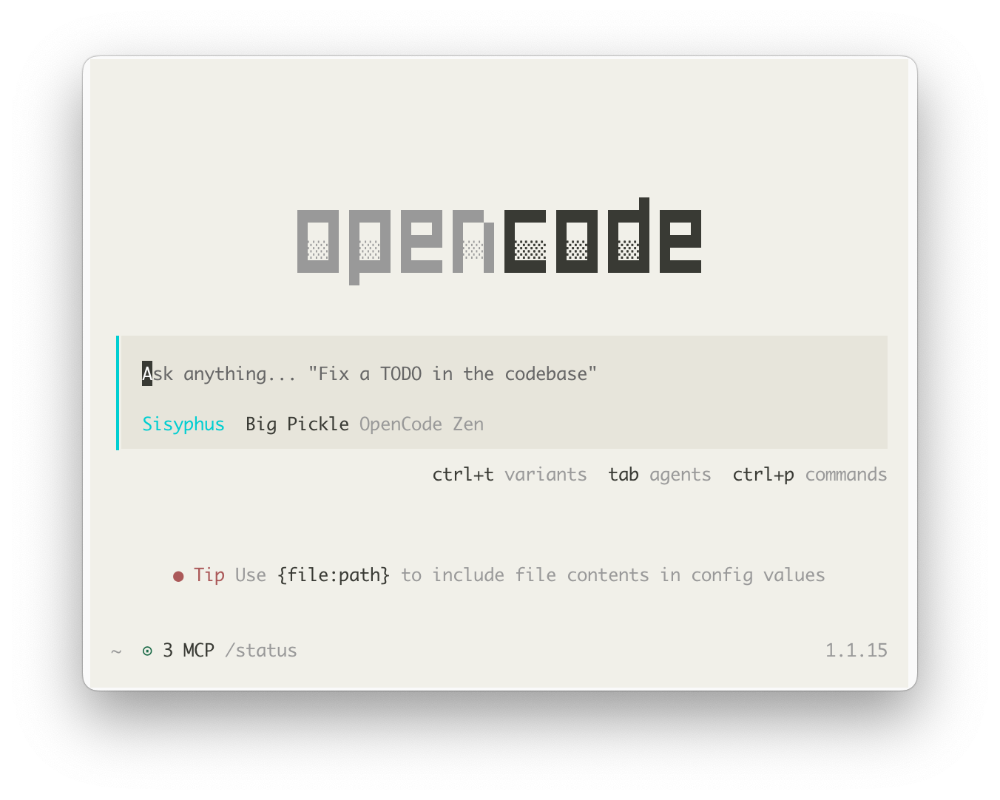

# Vitesse Theme for OpenCode

> Port of [Vitesse VS Code theme](https://github.com/antfu/vscode-theme-vitesse)

<table>
  <tr>
    <td align="center">
      
      <br>
      <sub><b>Vitesse Dark</b></sub>
    </td>
  </tr>
  <tr>
    <td align="center">
      
      <br>
      <sub><b>Vitesse Light</b></sub>
    </td>
  </tr>
  <tr>
    <td align="center">
      
      <br>
      <sub><b>Vitesse Light Soft</b></sub>
    </td>
  </tr>
</table>

## Install

**macOS / Linux**
```sh
curl -sL https://raw.githubusercontent.com/kvoon3/opencode-theme-vitesse/main/install.sh | bash
```

**Windows**
```powershell
irm https://raw.githubusercontent.com/kvoon3/opencode-theme-vitesse/main/install.ps1 | iex
```

Restart OpenCode, then use `/theme` to activate.

## Credits

- **Original VS Code Theme**: [Vitesse Theme for VS Code](https://github.com/antfu/vscode-theme-vitesse) by [Anthony Fu](https://github.com/antfu)
- **Color Palette Origin**: [prism-theme-vars](https://github.com/antfu/prism-theme-vars)

## License

[MIT](LICENSE.md)

---

<p align="center">
  <sub>Made with ♥ for OpenCode • Inspired by Vitesse</sub>
</p>
